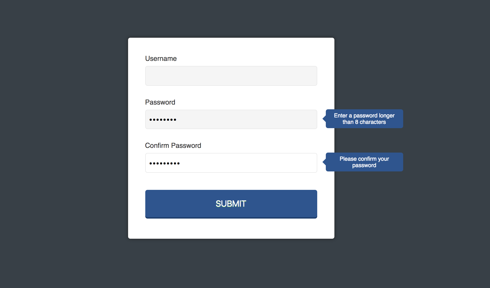

# CREATING A PASSWORD CONFIRMATION FORM USING JQUERY
Using keyboard events in jQuery to compare passwords in two fields and show hints if they don't match.

[Link to the live site](https://steph-blondet.github.io/password-confirmation-form-jquery/)

Technologies Used:
- HTML
- CSS
- JavaScript
- jQuery

## Desktop View

---------
*This application was built while taking the 'jQuery Basics' lesson at Treehouse. February, 2017.
